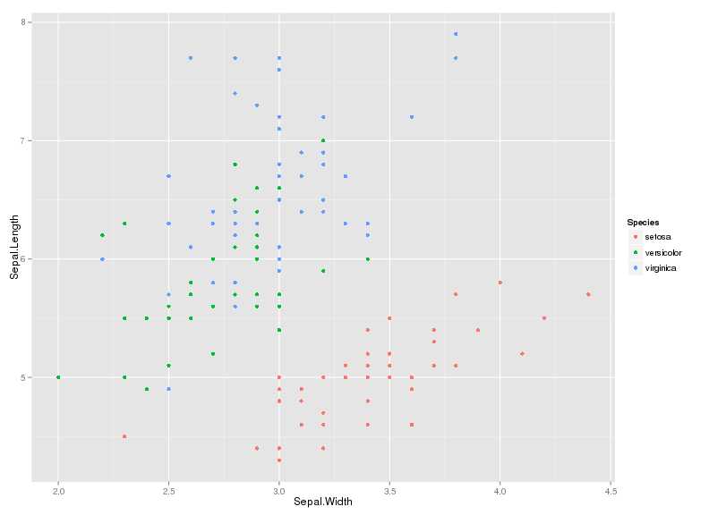

## Sample slide 1

1. Edit YAML front matter
2. Write using R Markdown
3. Use an empty line followed by three dashes to separate slides!

--- 

## Sepal Width and Sepal Length by Species (Iris dataset)

--- 

## Petal Width and Sepal Length by Species (Iris dataset)

--- 

The end

